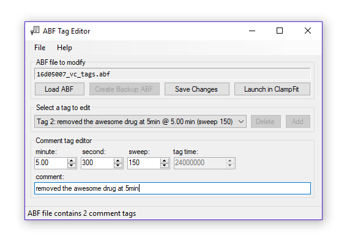

# ABF Tag Editor

**ABF Tag Editor is a program created for scientists to easily add and edit comment tags in ABF (Axon Binary Format) files.** ABF files are typically recorded with software like ClampEx and edited with software like ClampFit, but these packages do not allow tags to be added or modified after ABF files have been recorded. Since comment tags are often used to store important experiment information, it is critical that the scientist maintain the ability to correct erroneous tag comments or tag times, and to add additional tags as analytical needs evolve.

## Project Status
This project is in early development / alpha stage. It is not yet intended to be downloaded or used.

## Features
* ABF1 and ABF2 files are supported. 
* An original ABF file backup is created automatically before an ABF is modified.

## Additional Resources
* [pyABF](https://github.com/swharden/pyABF) - An ABF reader for Python
* [vsABF](https://github.com/swharden/vsABF) - An ABF reader for Visual Studio (written in C#)
* [Unofficial Guide to the ABF File Format](https://github.com/swharden/pyABF/tree/master/docs/advanced/abf-file-format)

## Author
Scott W Harden, D.M.D., Ph.D.\
President & CEO\
[Harden Technologies, LLC](https://tech.swharden.com)
